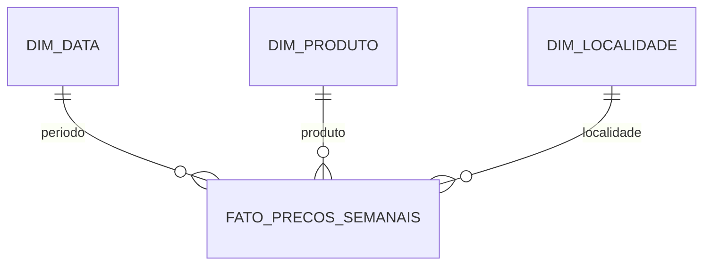

<div align="center">

# Observatório de Combustíveis Brasil

**Pipeline de Data Analytics para preços de combustíveis com dados públicos oficiais da ANP**


</div>

## Visão geral

O projeto analisa a evolução e a distribuição dos preços de combustíveis no Brasil a partir de dados públicos da Agência Nacional do Petróleo, Gás Natural e Biocombustíveis (ANP).

A proposta é construir um fluxo analítico reproduzível de ponta a ponta: aquisição, rastreabilidade, inspeção, tratamento, validação, consolidação, modelagem dimensional, SQL e visualização em Power BI.

## Pergunta analítica

**Como os preços dos combustíveis variam em 2026 ao longo do tempo e entre Brasil, regiões, estados, municípios e produtos?**

## Pipeline


## Implementado

- descoberta automática dos arquivos semanais oficiais;
- coleta para Brasil, regiões, estados e municípios de 2026;
- manifesto com URL, horário, tamanho e SHA-256;
- inspeção de schema e valores ausentes;
- detecção automática de cabeçalho;
- padronização de datas, colunas e valores monetários;
- consolidação exclusiva da série de 2026;
- identificação automática do nível geográfico;
- validações de qualidade;
- modelo estrela com três dimensões e uma tabela fato;
- DDL PostgreSQL com chaves, restrições e índices;
- views analíticas;
- consultas SQL para tendência, ranking, dispersão e etanol × gasolina;
- testes automatizados das regras centrais.

## Estrutura

```text
observatorio-combustiveis-brasil/
├── data/
│   ├── raw/
│   └── processed/
├── docs/
│   ├── dicionario-dados.md
│   ├── fontes.md
│   ├── metodologia.md
│   └── modelo-dados.md
├── notebooks/
├── reports/
├── sql/
│   ├── README.md
│   ├── queries.sql
│   ├── schema.sql
│   └── views.sql
├── src/
│   ├── build_model.py
│   ├── config.py
│   ├── consolidate.py
│   ├── download_history.py
│   ├── inspect_raw.py
│   ├── pipeline.py
│   ├── quality.py
│   └── transform.py
├── tests/
├── .gitignore
├── requirements.txt
└── README.md
```

## Execução

```bash
python -m venv .venv
```

No Windows PowerShell:

```powershell
.\.venv\Scripts\Activate.ps1
pip install -r requirements.txt
python -m src.pipeline
pytest
```

O pipeline executa seis etapas:

```text
1. download da série histórica
2. inspeção dos arquivos brutos
3. transformação e padronização
4. consolidação da série 2026
5. validação de qualidade
6. construção do modelo estrela
```

## Saídas locais

```text
data/processed/precos_semanais_2026.csv

data/processed/model/
├── dim_data.csv
├── dim_produto.csv
├── dim_localidade.csv
└── fato_precos_semanais.csv

reports/quality_2026.json
```

Os datasets são reconstruíveis e não são versionados no Git, mantendo o repositório leve.

## Modelo dimensional



O grão da fato é **período × produto × localidade × unidade de medida**.

A documentação completa está em [`docs/modelo-dados.md`](docs/modelo-dados.md).

## Análises previstas

- evolução semanal e mensal;
- preço médio, mínimo e máximo;
- amplitude e dispersão;
- comparação Brasil × região × estado × município;
- rankings geográficos;
- variação percentual;
- quantidade de postos pesquisados;
- relação etanol × gasolina;
- análise futura por posto e bandeira.

## Metodologia

O projeto preserva os agregados oficiais publicados pela ANP. Não tratamos uma média simples das médias municipais como equivalente ao indicador nacional oficial.

Veja [`docs/metodologia.md`](docs/metodologia.md).

## Princípios

- somente dados públicos reais;
- raw imutável;
- origem rastreável;
- transformação reproduzível;
- validação antes da visualização;
- nenhuma métrica digitada manualmente;
- nenhuma remoção automática de outliers;
- separação entre dado bruto, tratado e analítico.

## Status

**ETL, validação, consolidação 2026, modelo estrela e camada SQL implementados.**

Próxima etapa: processar os arquivos oficiais no ambiente local e construir os primeiros indicadores e visuais do Power BI a partir dos resultados reais.

## Licença

O código deste repositório é disponibilizado sob licença MIT. Os dados permanecem sujeitos aos termos e à origem de publicação da ANP.
