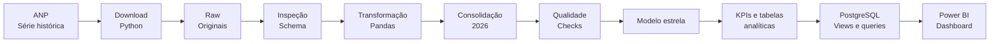

<div align="center">

# Observatório de Combustíveis Brasil

**Pipeline de Data Analytics para preços de combustíveis com dados públicos oficiais da ANP**


</div>

## Visão geral

O projeto analisa a evolução e a distribuição dos preços de combustíveis no Brasil a partir de dados públicos da Agência Nacional do Petróleo, Gás Natural e Biocombustíveis (ANP).

O fluxo foi desenhado como um projeto de Data Analytics reproduzível: aquisição, rastreabilidade, inspeção, tratamento, validação, consolidação, modelagem dimensional, SQL, KPIs, relatórios visuais e preparação para Power BI.\n\n<p align="center">\n  \n</p>

## Pergunta analítica

**Como os preços dos combustíveis variam em 2026 ao longo do tempo e entre Brasil, regiões, estados, municípios e produtos?**

## Pipeline



## Implementado

- descoberta automática dos arquivos semanais oficiais;
- coleta para Brasil, regiões, estados e municípios de 2026;
- coleta da base aberta por posto, com data, produto, preço, estabelecimento e bandeira;
- manifesto com URL, horário, tamanho e SHA-256;
- inspeção de schema e valores ausentes;
- detecção automática de cabeçalho;
- padronização de datas, colunas e valores monetários;
- consolidação da série de 2026;
- identificação do nível geográfico;
- validações de qualidade separadas para agregados e observações por posto;
- modelo estrela agregado com três dimensões e uma fato;
- segundo modelo estrela no grão por posto, preservando a separação entre agregados oficiais e observações individuais;
- DDL PostgreSQL, views e consultas analíticas;
- ambiente PostgreSQL reproduzível com Docker Compose;
- carga transacional dos dois modelos via PostgreSQL COPY;
- KPIs nacionais por produto;
- tendência mensal derivada das observações semanais;
- rankings por UF e município;
- relação etanol × gasolina comum;
- medidas DAX e especificação inicial do dashboard;
- geração automática de relatório de insights e gráficos a partir dos dados processados;
- testes automatizados das regras centrais.

## Estrutura

```text
observatorio-combustiveis-brasil/
├── data/
│   ├── raw/
│   └── processed/
├── docs/
│   ├── dicionario-dados.md
│   ├── fontes.md
│   ├── kpis.md
│   ├── metodologia.md
│   └── modelo-dados.md
├── assets/
│   ├── architecture.svg
│   └── generated/
├── notebooks/
├── powerbi/
│   ├── medidas.dax
│   └── README.md
├── reports/
├── docker-compose.yml
├── .env.example
├── sql/
├── src/
│   ├── analytics.py
│   ├── build_model.py
│   ├── consolidate.py
│   ├── download_history.py
│   ├── download_open_data.py
│   ├── inspect_raw.py
│   ├── load_postgres.py
│   ├── database.py
│   ├── pipeline.py
│   ├── quality.py
│   ├── reporting.py
│   ├── station_data.py
│   ├── station_quality.py
│   └── transform.py
├── tests/
├── .gitignore
├── requirements.txt
└── README.md
```

## Execução completa

```bash
python -m venv .venv
```

No Windows PowerShell:

```powershell
.\.venv\Scripts\Activate.ps1
pip install -r requirements.txt
python -m src.pipeline
pytest

docker compose up -d postgres
python -m src.load_postgres
```

O pipeline executa onze etapas:

```text
1. download da série agregada
2. download dos dados abertos por posto
3. inspeção dos arquivos brutos agregados
4. transformação da série agregada
5. consolidação da série agregada 2026
6. validação de qualidade agregada
7. construção do modelo estrela agregado
8. construção da camada por posto
9. validação de qualidade por posto
10. geração das tabelas analíticas
11. geração do relatório e dos gráficos
```

## PostgreSQL

Depois de gerar os datasets, o banco local pode ser iniciado e carregado com:

```powershell
docker compose up -d postgres
python -m src.load_postgres
```

A carga cria e popula os dois modelos dimensionais, recria as views e valida as tabelas fato antes de confirmar a transação.

Veja [`docs/postgresql.md`](docs/postgresql.md).

## Relatórios de qualidade

O pipeline gera localmente:

```text
reports/quality_2026.json
reports/quality_postos_2026.json
```

O segundo relatório mede também cobertura de UFs, municípios, produtos, CNPJ e bandeira, além de datas, preços e duplicidades.

## Saídas visuais

Após o processamento, o pipeline gera automaticamente três gráficos em `assets/generated/` e o relatório `reports/insights_2026.md`. Esses arquivos são derivados das tabelas processadas e não contêm valores analíticos fixados manualmente no código.

## Saídas analíticas

Além do modelo estrela, o pipeline gera:

```text
data/processed/analytics/
├── kpis_brasil_2026.csv
├── tendencia_mensal_brasil_2026.csv
├── ranking_ufs_ultima_semana.csv
├── ranking_municipios_ultima_semana.csv
└── etanol_gasolina_ultima_semana.csv
```

Essas tabelas são derivadas dos dados processados e não são mantidas manualmente.

## Duas camadas de dados

O projeto mantém dois grãos analíticos separados:

- **agregado oficial:** período × produto × localidade, usado para indicadores oficiais;
- **por posto:** data da coleta × estabelecimento × produto, usado para dispersão, bandeira e comparação entre revendas.

A documentação da camada por estabelecimento está em [`docs/dados-abertos-postos.md`](docs/dados-abertos-postos.md).

## Dashboard planejado

O Power BI terá quatro páginas principais:

1. **Visão Geral** — preço atual, variação, amplitude, postos e evolução semanal;
2. **Geografia** — comparação entre UFs e municípios;
3. **Tendência** — evolução semanal e indicador mensal derivado;
4. **Etanol × Gasolina** — relação observada entre os dois combustíveis.

A especificação e as medidas DAX estão em [`powerbi/README.md`](powerbi/README.md).

## Metodologia

O projeto preserva os agregados oficiais publicados pela ANP. Não tratamos uma média simples das médias municipais como equivalente ao indicador nacional oficial.

Indicadores derivados são explicitamente identificados. Veja [`docs/kpis.md`](docs/kpis.md) e [`docs/metodologia.md`](docs/metodologia.md).

## Princípios

- somente dados públicos reais;
- raw imutável;
- origem rastreável;
- transformação reproduzível;
- validação antes da visualização;
- nenhuma métrica digitada manualmente;
- nenhuma remoção automática de outliers;
- separação entre dado bruto, tratado e analítico.

## Status

**ETL agregado e por posto, validação, dois modelos dimensionais, PostgreSQL reproduzível, SQL, KPIs e geração visual automática implementados.**

A próxima etapa é executar o pipeline contra os arquivos oficiais, revisar os resultados reais e construir o arquivo do dashboard.

## Licença

O código deste repositório é disponibilizado sob licença MIT. Os dados permanecem sujeitos aos termos e à origem de publicação da ANP.
