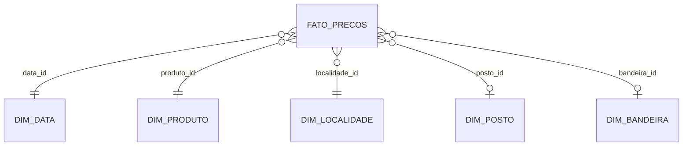

<div align="center">

# Observatório de Combustíveis Brasil

**Pipeline analítico de preços de combustíveis no Brasil com dados públicos oficiais da ANP**


</div>

## Visão geral

O projeto analisa a evolução e a distribuição dos preços de combustíveis no Brasil a partir de dados públicos da Agência Nacional do Petróleo, Gás Natural e Biocombustíveis (ANP).

O objetivo é construir um fluxo analítico reproduzível, cobrindo aquisição, rastreabilidade, tratamento, validação, modelagem, análise exploratória, SQL e visualização em Power BI.

## Pergunta analítica

**Como os preços dos combustíveis variam ao longo do tempo e entre regiões, estados, municípios, produtos e postos revendedores?**

## Arquitetura


## Escopo analítico

- evolução semanal, mensal e anual dos preços;
- preço médio, mediano, mínimo e máximo;
- amplitude, desvio padrão e coeficiente de variação;
- comparação entre Brasil, regiões, UFs e municípios;
- comparação entre produtos;
- distribuição de preços por posto e bandeira, quando disponível;
- diferença de cada localidade em relação à média nacional;
- análise da relação entre preços de etanol e gasolina;
- identificação e documentação de valores extremos;
- acompanhamento da cobertura da pesquisa ao longo do tempo.

## Fontes oficiais

A base principal é o Levantamento de Preços de Combustíveis da ANP. A página das últimas pesquisas foi atualizada em 25/09/2026 e publica, no topo, a semana de 20/09/2026 a 26/09/2026.

O projeto também utilizará a série histórica oficial e poderá incorporar dados cadastrais dos revendedores para enriquecimento analítico.

As fontes e regras de rastreabilidade estão em [`docs/fontes.md`](docs/fontes.md), e o dicionário de campos normalizados está em [`docs/dicionario-dados.md`](docs/dicionario-dados.md).

## Estrutura

```text
observatorio-combustiveis-brasil/
├── data/
│   ├── raw/
│   └── processed/
├── docs/
│   ├── dicionario-dados.md
│   ├── fontes.md
│   └── metodologia.md
├── notebooks/
├── sql/
│   └── schema.sql
├── src/
│   ├── __init__.py
│   ├── config.py
│   ├── download_anp.py
│   ├── inspect_raw.py
│   └── transform.py
├── tests/
├── .gitignore
├── requirements.txt
└── README.md
```

## Execução

```bash
python -m venv .venv
```

No Windows PowerShell:

```powershell
.\.venv\Scripts\Activate.ps1
pip install -r requirements.txt

python -m src.download_anp
python -m src.inspect_raw
python -m src.transform
pytest
```

### O que acontece em cada etapa

1. `download_anp` localiza os links mais recentes publicados pela ANP, baixa os arquivos e grava um manifesto com origem, horário da coleta, tamanho e SHA-256.
2. `inspect_raw` registra abas, dimensões, colunas e valores ausentes sem alterar os arquivos brutos.
3. `transform` detecta automaticamente a linha real de cabeçalho, mesmo quando a planilha contém títulos ou observações antes da tabela; em seguida normaliza tipos e nomes de colunas.
4. Os CSVs tratados são gravados em `data/processed/`.

Os dados brutos e processados não são versionados no Git para evitar crescimento desnecessário do repositório. O código para reproduzi-los permanece versionado.

## Modelo dimensional planejado



## Princípios

- dados reais e públicos;
- nenhuma alteração nos arquivos brutos;
- rastreabilidade da origem;
- transformações reproduzíveis em código;
- validações antes da análise;
- preservação de campos novos publicados pela fonte;
- separação entre dado bruto, tratado e camada analítica;
- nenhuma métrica digitada manualmente;
- conclusões baseadas somente nos dados efetivamente processados.

## Status

**Fase 1 em andamento: aquisição, inspeção e padronização.**

A estrutura de transformação já está preparada para as planilhas da ANP. A próxima entrega é consolidar a série de 2026 e produzir a primeira tabela analítica para exploração em Python e SQL.

## Licença

O código deste repositório é disponibilizado sob licença MIT. Os dados permanecem sujeitos aos termos e à origem de publicação da ANP.
