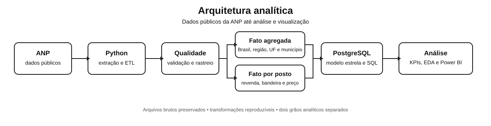

<div align="center">

# Observatório de Combustíveis Brasil

**Data Analytics de preços de combustíveis com dados públicos oficiais da ANP**

[](https://github.com/peedrovinicius/observatorio-combustiveis-brasil/actions/workflows/ci.yml)


</div>

## Sobre o projeto

O Observatório de Combustíveis Brasil analisa como os preços de combustíveis variam em 2026 entre períodos, produtos e localidades.

A fonte principal é a Agência Nacional do Petróleo, Gás Natural e Biocombustíveis (ANP). O projeto cobre o fluxo completo de Data Analytics, desde a aquisição e validação dos dados até modelagem dimensional, SQL, KPIs, relatório web e preparação para Power BI.

<p align="center">
  
</p>

## O que o projeto entrega

- ingestão e validação de dados oficiais da ANP, com manifestos e SHA-256;
- camadas analíticas separadas para agregados oficiais e preços por posto;
- modelos estrela e carga PostgreSQL com DDL, views e consultas analíticas;
- KPIs de preço, dispersão, cobertura, bandeiras e relação etanol/gasolina;
- notebook, relatório web estático e especificação para Power BI;
- auditoria de exclusões, sobreposições e qualidade dos dados;
- testes unitários, integração offline e PostgreSQL real na CI;
- smoke test periódico das fontes oficiais.

## Arquitetura de dados

O projeto mantém dois grãos analíticos separados para não misturar conceitos diferentes:

| Camada | Grão | Uso principal |
| --- | --- | --- |
| Agregados oficiais | período × produto × unidade de medida × localidade | indicadores publicados e comparações geográficas |
| Preços por posto | data da coleta × posto × produto × unidade de medida | dispersão, bandeira, revenda e distribuição de preços |

Os detalhes estão em [`docs/modelo-dados.md`](docs/modelo-dados.md) e [`docs/dados-abertos-postos.md`](docs/dados-abertos-postos.md).

## Stack

| Área | Tecnologia |
| --- | --- |
| Extração e transformação | Python, pandas, requests |
| Qualidade | validações próprias, pytest, GitHub Actions |
| Banco de dados | PostgreSQL |
| Modelagem | modelo estrela |
| Análise | Python, SQL, Jupyter |
| Visualização | Power BI, Matplotlib |
| Ambiente local | Docker Compose |
| Publicação visual | HTML e CSS estáticos |

## Execução rápida

No Windows:

```powershell
powershell -ExecutionPolicy Bypass -File .\scripts\run_local.ps1
```

Para gerar também o snapshot revisável dos resultados:

```powershell
powershell -ExecutionPolicy Bypass -File .\scripts\run_local.ps1 -Snapshot
```

O snapshot cria o relatório de resultados, os gráficos, o relatório web estático e atualiza localmente a seção visual do README. Nenhum commit ou push é feito automaticamente.

Instruções completas: [`docs/execucao.md`](docs/execucao.md).

<!-- RESULTS:START -->
<!-- RESULTS:END -->

## Saídas analíticas

O pipeline gera localmente:

```text
data/processed/precos_semanais_2026.csv
data/processed/precos_postos_2026.csv

data/processed/model/
data/processed/model_postos/
data/processed/analytics/
data/processed/analytics_postos/

reports/aggregate_ingestion_audit_2026.json
reports/quality_2026.json
reports/station_ingestion_audit_2026.json
reports/quality_postos_2026.json
reports/insights_2026.md

assets/generated/
assets/snapshot/

docs/resultados-2026.md
docs/index.html
```

Os datasets brutos e processados não são versionados. Eles podem ser reconstruídos pelas fontes e pelo código do repositório.

## Power BI

O dashboard foi especificado em cinco páginas:

1. **Visão Geral**: KPIs e evolução semanal
2. **Geografia**: UFs e municípios
3. **Tendência**: comportamento temporal
4. **Mercado por Posto**: distribuição, bandeiras e revendas
5. **Etanol × Gasolina**: relação observada por município

Tema, medidas DAX e layout: [`powerbi/`](powerbi/).

## Metodologia

O projeto preserva os agregados oficiais da ANP e não trata uma média simples das médias municipais como equivalente ao indicador nacional oficial.

Indicadores derivados são identificados como cálculos do projeto. Valores extremos são sinalizados para revisão, não removidos automaticamente.

Documentação:

- [Fontes](docs/fontes.md)
- [Metodologia](docs/metodologia.md)
- [Dicionário de dados](docs/dicionario-dados.md)
- [KPIs](docs/kpis.md)
- [Modelo de dados](docs/modelo-dados.md)
- [PostgreSQL](docs/postgresql.md)
- [Relatório web](docs/site.md)
- [Testes](docs/testes.md)

## Contribuindo

Contribuições externas são bem-vindas. Antes de abrir um Pull Request, consulte o [guia de contribuição](CONTRIBUTING.md) e use as issues para alinhar o escopo da mudança.

## Status

Pipeline agregado e por posto, validação, modelos dimensionais, PostgreSQL, SQL, KPIs agregados e por estabelecimento, notebook, snapshots e relatório web estático implementados.

A publicação de métricas e gráficos no README ocorre somente depois da execução e revisão do snapshot com os dados oficiais.

## Licença

O código deste repositório é disponibilizado sob licença MIT. Os dados permanecem sujeitos aos termos e à origem de publicação da ANP.
