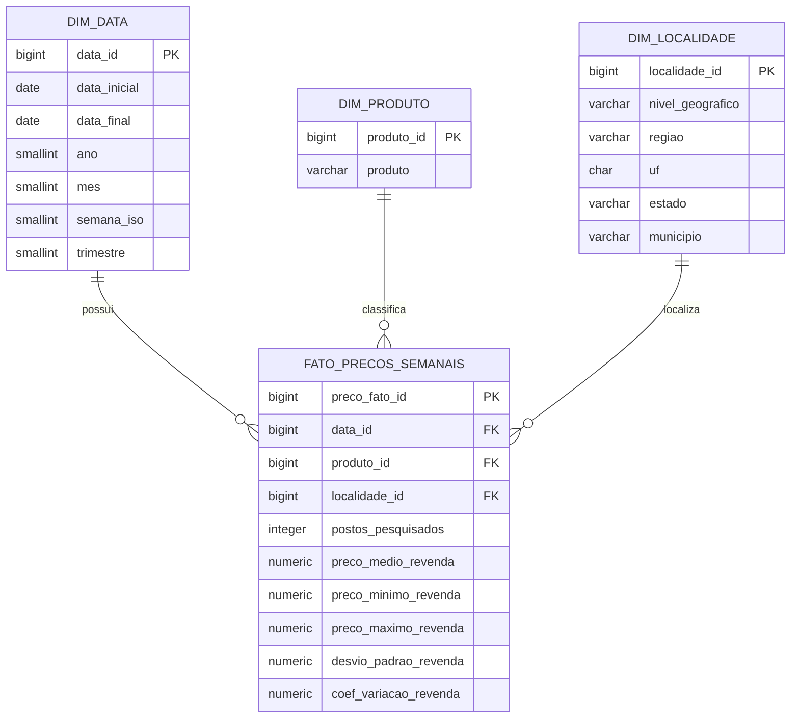

# Modelo de dados

## Modelo estrela

## Grão da fato

Uma linha da `fato_precos_semanais` representa uma observação semanal agregada para a combinação:

**período × produto × localidade × unidade de medida**

O nível geográfico é armazenado na dimensão de localidade e pode ser:

- Brasil;
- região;
- estado;
- município.

## Por que separar dimensões

A modelagem evita repetição de atributos textuais na fato e simplifica relacionamentos no Power BI e consultas SQL.

A mesma estrutura também permite criar filtros consistentes por período, produto e geografia sem duplicar regras em cada visual.

## Dados por posto

Os registros por posto revendedor têm grão diferente dos dados agregados e, por isso, não serão misturados na mesma fato. Quando incorporados, formarão uma segunda tabela fato específica para observações por estabelecimento.
