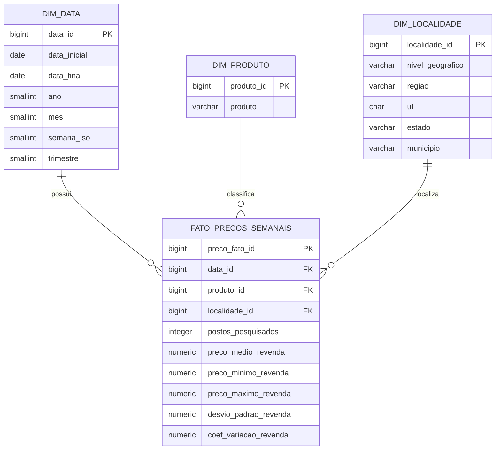

# Modelo de dados

## Modelo estrela



## Grão da fato

Uma linha da `fato_precos_semanais` representa uma observação semanal agregada para a combinação:

**período × produto × localidade × unidade de medida**

O nível geográfico é armazenado na dimensão de localidade e pode ser:

- Brasil;
- região;
- estado;
- município.

Antes da modelagem, o pipeline valida a identidade mínima da localidade. Região exige o nome da região. Estado exige UF ou nome do estado. Município exige o nome do município e também UF ou nome do estado, evitando uma localidade municipal sem contexto estadual.

## Por que separar dimensões

A modelagem evita repetição de atributos textuais na fato e simplifica relacionamentos no Power BI e consultas SQL.

A mesma estrutura também permite criar filtros consistentes por período, produto e geografia sem duplicar regras em cada visual.

## Dados por posto

Os registros por posto revendedor têm grão diferente dos dados agregados e, por isso, permanecem em uma segunda tabela fato específica para observações por estabelecimento.

O modelo por posto é composto por:

- `dim_data_coleta`;
- `dim_produto_posto`;
- `dim_posto`;
- `fato_precos_postos`.

O grão da fato por posto é:

**data da coleta × posto × produto × unidade de medida**

### Identidade estável do posto

Quando o CNPJ está disponível, ele é a identidade principal do estabelecimento. Todas as observações do mesmo CNPJ apontam para o mesmo `posto_id`, mesmo que atributos cadastrais como nome, bandeira ou endereço mudem entre coletas.

A `dim_posto` usa uma estratégia SCD tipo 1 simples: mantém um único registro por identidade e conserva os atributos da observação mais recente disponível. O histórico de preços permanece integral na fato e continua ligado ao mesmo `posto_id`.

Além da chave substituta `posto_id`, a dimensão persiste `posto_chave`, uma chave técnica determinística SHA-256 com 64 caracteres derivada da identidade do estabelecimento. Ela é reproduzível entre execuções e possui restrição de unicidade no PostgreSQL. A identidade textual completa não precisa ser usada como índice, evitando chaves excessivamente largas.

O CNPJ é lido como texto e normalizado preservando zeros à esquerda e caracteres alfanuméricos nas 14 posições cadastrais. As 12 primeiras posições aceitam letras ou números e as duas últimas permanecem numéricas. Essa validação é estrutural e não recalcula os dígitos verificadores.

Quando o CNPJ não está disponível, o projeto usa uma identidade de fallback baseada em UF, município, revenda, logradouro e número. Os cinco campos são obrigatórios para que essa identidade alternativa seja considerada confiável. Nesse caso, mudanças nesses atributos podem representar uma nova identidade, pois não há uma chave cadastral mais forte disponível na fonte.

Linhas com fallback incompleto são preservadas separadamente durante a consolidação para evitar fusão indevida de estabelecimentos e são bloqueadas pela qualidade antes da modelagem.

Essa decisão evita inflar contagens de estabelecimentos no PostgreSQL e no Power BI por simples alterações cadastrais.


## Barreira de qualidade antes da modelagem por posto

A base consolidada por estabelecimento não é transformada diretamente em modelo estrela.

Antes da criação de `dim_data_coleta`, `dim_produto_posto`, `dim_posto` e `fato_precos_postos`, o projeto exige que a validação da camada por posto retorne `status = passed`.

Essa separação impede que um conjunto com problemas estruturais seja materializado em dimensões, fatos ou posteriormente carregado no PostgreSQL.

A modelagem exige também `fonte_arquivo` para cada observação. Esse campo preserva a rastreabilidade até o arquivo bruto e faz parte do contrato da `fato_precos_postos`. Se ele estiver ausente, a modelagem falha com erro explícito de contrato antes de construir os CSVs.


## Unicidade do grão nas tabelas fato

O PostgreSQL aplica uma segunda barreira contra duplicação lógica, além das validações executadas em Python.

Na série agregada, o grão protegido é:

```text
data_id + produto_id + localidade_id + unidade_medida
```

A carga usa um índice único com `COALESCE(unidade_medida, '')`, de modo que valores nulos da unidade não criem múltiplas linhas equivalentes.

Na camada por posto, o grão protegido é:

```text
data_coleta_id + produto_posto_id + posto_id
```

Como `produto_posto_id` já representa produto e unidade de medida, esse conjunto identifica uma observação única de preço por estabelecimento na data.

As restrições do banco são defesa em profundidade. A deduplicação e a validação continuam ocorrendo antes da modelagem.

A unicidade de `posto_chave` é finalizada somente depois da limpeza transacional da carga anterior. Essa ordem permite atualizar bancos locais legados mesmo quando dados antigos não obedeciam à restrição atual.


## Unicidade das dimensões naturais

Além das chaves substitutas usadas nos relacionamentos, o PostgreSQL protege identidades naturais das dimensões.

Para `dim_localidade`, a identidade lógica é:

```text
nivel_geografico + regiao + uf + estado + municipio
```

Como campos geográficos ficam vazios em níveis mais amplos, o índice único normaliza valores nulos antes da comparação. Isso impede, por exemplo, duas linhas equivalentes para o nível Brasil com chaves substitutas diferentes.

Para `dim_produto_posto`, a identidade lógica é:

```text
produto + unidade_medida
```

A unidade de medida é obrigatória nessa dimensão, em linha com a validação da camada por posto.

Essas restrições complementam o `drop_duplicates` executado na modelagem Python e impedem duplicação lógica caso um CSV seja alterado ou uma carga seja executada fora do fluxo esperado.
