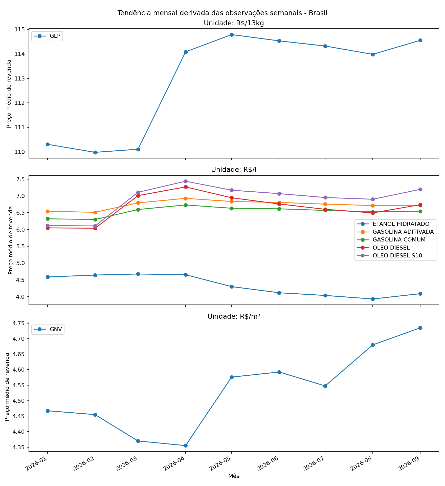
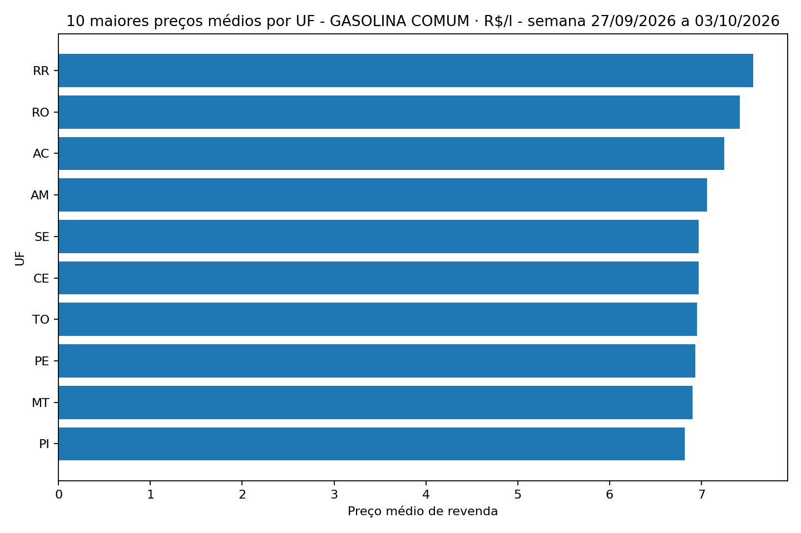
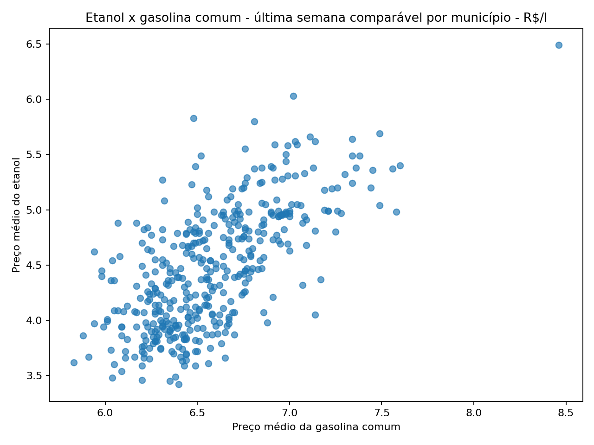
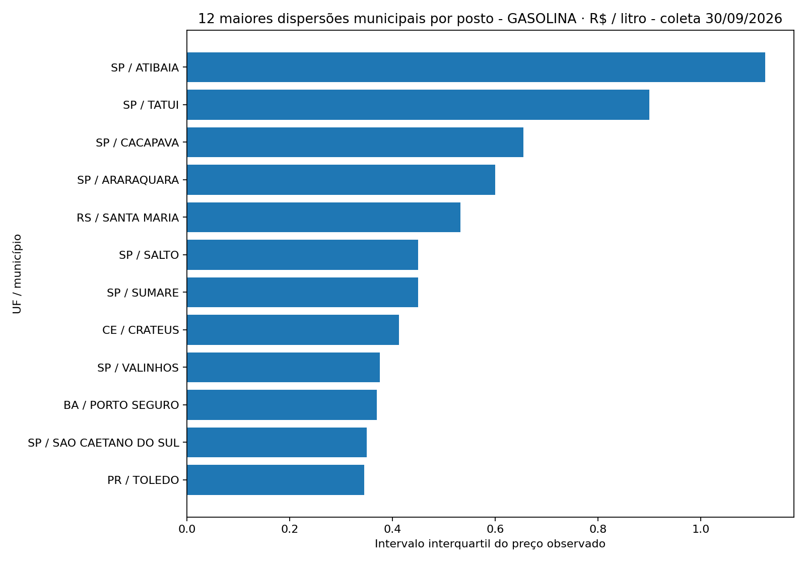
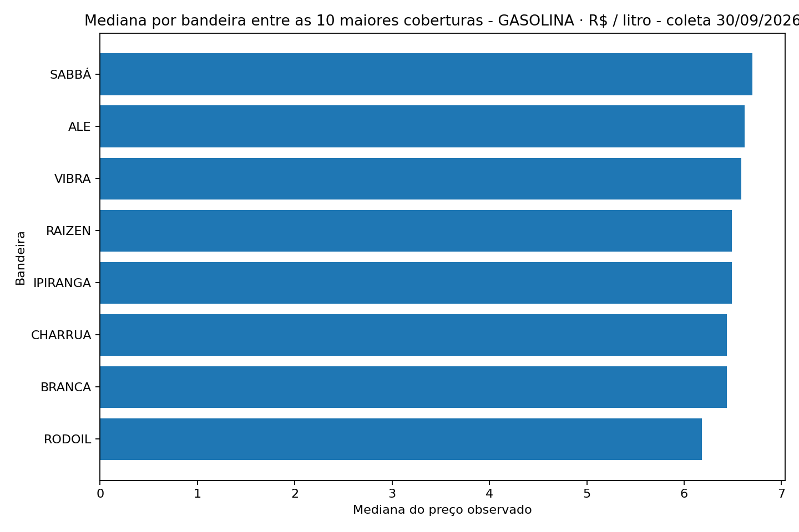

# Resultados 2026

Snapshot gerado automaticamente a partir dos dados processados pelo pipeline.

Gerado em: **2026-10-04 14:02 UTC**

> Este arquivo não deve ser editado manualmente para alterar métricas. Reexecute o pipeline e o comando de snapshot para atualizar os resultados.

# Insights automáticos

Relatório gerado exclusivamente a partir das saídas do pipeline.

## Brasil

### ETANOL HIDRATADO · R$/l

- Preço na última semana: **R$ 4,13**
- Variação semanal: **+0,73%**
- Variação desde o início de 2026: **-8,83%**
- Menor preço médio semanal em 2026: **R$ 3,91**
- Maior preço médio semanal em 2026: **R$ 4,72**

### GASOLINA ADITIVADA · R$/l

- Preço na última semana: **R$ 6,72**
- Variação semanal: **-0,15%**
- Variação desde o início de 2026: **+3,23%**
- Menor preço médio semanal em 2026: **R$ 6,50**
- Maior preço médio semanal em 2026: **R$ 6,98**

### GASOLINA COMUM · R$/l

- Preço na última semana: **R$ 6,55**
- Variação semanal: **+0,00%**
- Variação desde o início de 2026: **+4,13%**
- Menor preço médio semanal em 2026: **R$ 6,28**
- Maior preço médio semanal em 2026: **R$ 6,78**

### GLP · R$/13kg

- Preço na última semana: **R$ 114,88**
- Variação semanal: **+0,07%**
- Variação desde o início de 2026: **+4,08%**
- Menor preço médio semanal em 2026: **R$ 109,67**
- Maior preço médio semanal em 2026: **R$ 114,98**

### GNV · R$/m³

- Preço na última semana: **R$ 4,74**
- Variação semanal: **-0,21%**
- Variação desde o início de 2026: **+5,80%**
- Menor preço médio semanal em 2026: **R$ 4,33**
- Maior preço médio semanal em 2026: **R$ 4,76**

### OLEO DIESEL · R$/l

- Preço na última semana: **R$ 6,90**
- Variação semanal: **+0,73%**
- Variação desde o início de 2026: **+14,05%**
- Menor preço médio semanal em 2026: **R$ 6,03**
- Maior preço médio semanal em 2026: **R$ 7,45**

### OLEO DIESEL S10 · R$/l

- Preço na última semana: **R$ 7,35**
- Variação semanal: **+0,27%**
- Variação desde o início de 2026: **+20,10%**
- Menor preço médio semanal em 2026: **R$ 6,09**
- Maior preço médio semanal em 2026: **R$ 7,58**

## Ranking por UF

Série selecionada: **GASOLINA COMUM · R$/l**

Período: **semana 27/09/2026 a 03/10/2026**

### 5 maiores preços médios

- RR: R$ 7,56
- RO: R$ 7,42
- AC: R$ 7,25
- AM: R$ 7,06
- CE: R$ 6,97

### 5 menores preços médios

- RS: R$ 6,24
- MG: R$ 6,36
- SP: R$ 6,36
- MS: R$ 6,42
- PB: R$ 6,42

## Qualidade dos dados

- Série agregada: **passed**
- Dados por posto: **passed**
- Postos distintos: **8271**
- Municípios cobertos: **417**

## Observação metodológica

Os indicadores nacionais, regionais e estaduais preservam os agregados oficiais publicados pela ANP. Indicadores derivados pelo projeto são identificados como tal e não substituem as séries oficiais.

## Visualizações

### Tendência Brasil

### Ranking de UFs

### Etanol x gasolina

### Dispersão municipal por posto

### Mediana por bandeira

